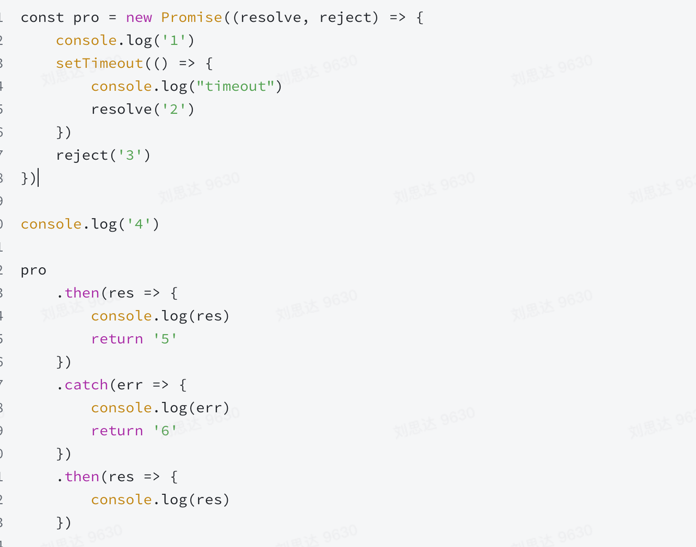

- react-intl 的原理和缺陷优化

- hash router 和 history router 的区别和优缺点，还问了移动端非浏览器环境的路由（就扯了一通react-router自己实现的history和浏览器没啥关系，哪儿都能用）

- jsonp 以及别的跨域的解决方案

- promise 打印


- 实现一个 Tab 切换的组件


- 最大上升子序列长度
```
给你一个整数数组 nums ，找到其中最长严格递增子序列的长度。
input：nums = [0,0,0]
output：1
input：nums = [0,1,0,3,2,3]
output：4
0 <= nums[i] <= 10000

function findMax(nums) {}
```